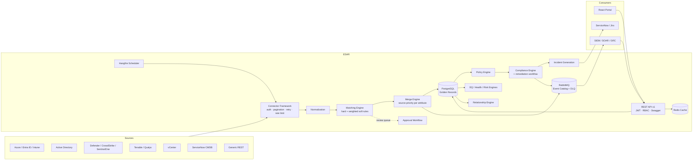
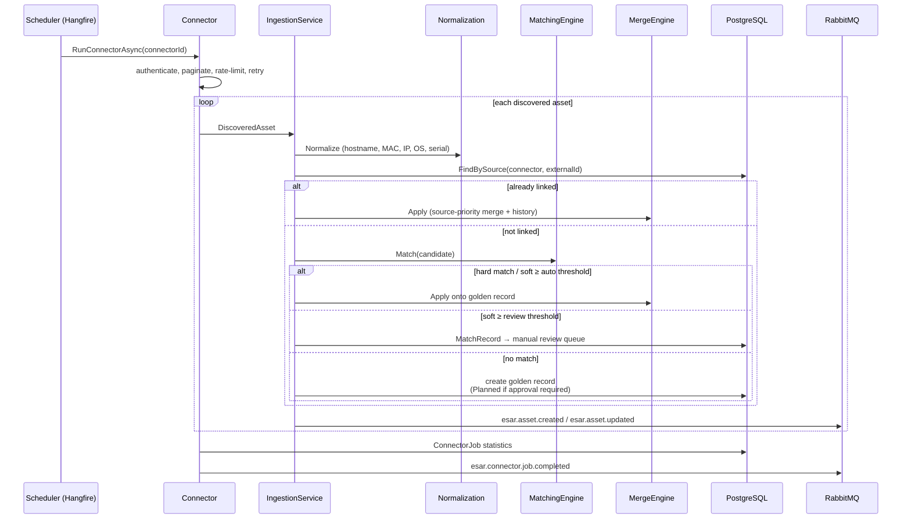
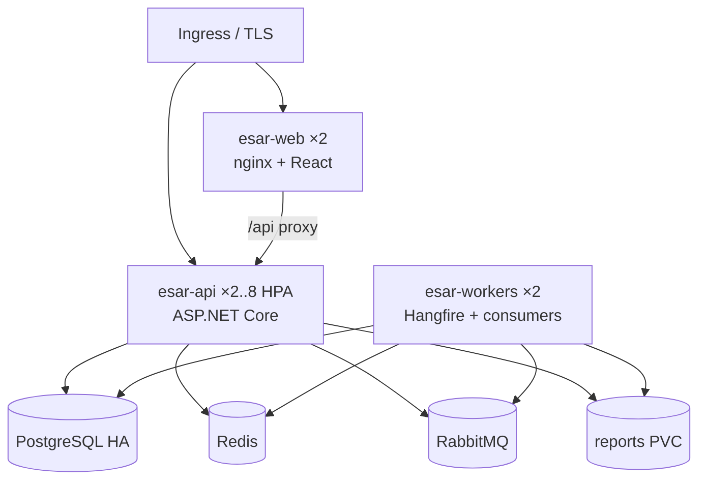

# ESAR — Software Architecture Document

## 1. Overview

ESAR is a platform-independent asset registry that ingests inventory from security and
infrastructure systems, correlates it into golden records, and layers governance
(compliance, risk, quality, approvals) on top. It follows **Clean Architecture** with a
strict dependency rule: `Api / Workers → Infrastructure → Application → Domain`.

## 2. Projects

| Project | Responsibility |
|---|---|
| `ESAR.Domain` | Entities, enums. Zero dependencies. |
| `ESAR.Application` | All business logic: normalization, matching, merge, source priority, policy, compliance, scoring, relationships, approvals, incidents, notifications, lifecycle, CQRS handlers (MediatR) for assets, abstractions (`IUnitOfWork`, `IConnector`, `IEventBus`, …). |
| `ESAR.Infrastructure` | EF Core (PostgreSQL), repositories, Redis cache, RabbitMQ bus, JWT/BCrypt/AES-GCM security, connectors, notification senders, ticketing clients, report generator, dashboard queries. |
| `ESAR.Api` | ASP.NET Core REST API: versioned controllers, JWT (local + Entra ID), permission-based RBAC policies, Swagger, rate limiting, health checks, audit/exception middleware. |
| `ESAR.Workers` | Hangfire server (per-connector cron discovery, compliance sweep, scoring, lifecycle, cleanup, escalation, notification dispatch) + RabbitMQ consumer with dead-letter queue. |

## 3. Ingestion pipeline (sequence)

## 4. Engines

- **Matching Engine** — data-driven rules (`matching_rules` table): hard rules checked in priority
  order return confidence 1.0; soft rules contribute weights normalized by applicable weight sum.
  Thresholds (`matching.autoMergeThreshold`, `matching.reviewThreshold`) are settings. Every decision
  stores a per-rule explanation JSON; `/matching/simulate` is a dry run; rules carry a version counter.
- **Source Priority Engine** — connector-level priorities with attribute-level overrides
  (e.g. ServiceNow owns `OwnerName`, Defender owns `OperatingSystem`). Merge only overwrites a
  value when the incoming source outranks the value's current owner (tracked in
  `assets.AttributeSourcesJson`).
- **Policy Engine** — `compliance_policies` scope (asset types, environments, min criticality) →
  required + mandatory control sets. First matching policy by priority wins; unmatched assets get
  the full default baseline.
- **Compliance Engine** — evaluates only policy-required controls; mandatory failures force
  NonCompliant; `RiskAccepted` remediation state exempts a control; auto-assigns workflow states
  (Missing SIEM → *WaitingSiemOnboarding*, etc.) while preserving operator-set states.
- **Data Quality Engine** — issue catalog (missing owner/BU/criticality/classification/OS, invalid
  hostname, no IP, stale telemetry, single source, conflicting hostnames) with weighted penalties → 0–100 score.
- **Asset Health Engine** — recency, EDR freshness, monitoring/backup coverage, compliance posture → 0–100.
- **Risk Scoring Engine** — criticality base + vulnerability pressure (capped) + compliance +
  exposure (internet-facing, production, public IP) + sensitivity → 0–100, recalculated on schedule.
- **Relationship Engine** — directed typed edges; BFS impact analysis (downstream blast radius,
  upstream dependencies) with per-node relationship path.
- **Approval Workflow** — optional activation gate for discovered assets
  (`approval.requireForNewAssets`), four-eyes merges, ownership/metadata changes; approve/reject
  applies the payload transactionally.

## 5. Event catalog

All events are JSON messages on the `esar.events` topic exchange. Failed consumer messages are
dead-lettered to `esar.dead-letter` via the `esar.dlx` exchange.

| Topic | Emitted when |
|---|---|
| `esar.asset.created` / `updated` / `deleted` / `merged` | Golden record lifecycle |
| `esar.compliance.evaluated` / `failed` | Every evaluation / non-compliant result |
| `esar.policy.violation` | Mandatory control failed |
| `esar.connector.job.completed` / `failed` | Synchronization results |
| `esar.dataquality.degraded` | DQ score fell below `dataquality.alertBelowScore` |
| `esar.approval.requested` / `decided` | Approval workflow |
| `esar.incident.created`, `esar.notification.queued` | Ops |
| `esar.connector.run` (inbound) | API-triggered manual sync consumed by workers |

## 6. Deployment

Horizontal scaling: API is stateless (JWT, Redis cache); workers scale via Hangfire's
PostgreSQL-backed queues; connectors are re-entrant (idempotent upserts by `(connector, externalId)`).
Targets: 100k+ assets (indexed lookups + `AsSplitQuery`), millions of events (append-only jsonb tables + retention cleanup).

## 7. Security

TLS everywhere (HSTS in production), JWT HS256 + optional Entra ID bearer, permission-based RBAC
(claims `permission:*`), BCrypt (work factor 12) with lockout, AES-256-GCM for connector secrets at
rest, secrets injected via env/K8s secrets, FluentValidation + RFC7807 errors, per-identity fixed-window
rate limiting, full audit trail, non-root containers.
