# ESAR — Database Design

PostgreSQL 16, normalized schema, enums stored as text, flexible payloads as `jsonb`.
Authoritative DDL: [db/001_schema.sql](../db/001_schema.sql) plus the ordered incremental scripts through [db/009_match_merge_safety.sql](../db/009_match_merge_safety.sql).

## ER diagram

```mermaid
erDiagram
    assets ||--o{ asset_sources : "reported by"
    assets ||--o{ asset_ips : has
    assets ||--o{ asset_tags : has
    assets ||--o{ asset_history : "changed"
    assets ||--o{ asset_software : runs
    assets ||--o{ asset_compliance : "evaluated"
    assets ||--o| asset_risk : scored
    assets ||--o{ asset_events : emits
    assets ||--o{ asset_relationships : "source of"
    assets ||--o{ asset_relationships : "target of"
    assets ||--o{ approval_requests : "gated by"
    assets ||--o{ incidents : triggers
    assets ||--o{ match_records : "matched to"
    compliance_policies ||--o{ asset_compliance : requires
    connectors ||--o{ connector_jobs : executes
    users ||--o{ user_roles : has
    roles ||--o{ user_roles : grants
    roles ||--o{ role_permissions : includes
    permissions ||--o{ role_permissions : "granted via"

    assets {
        uuid Id PK
        string Hostname
        string NormalizedHostname
        string Fqdn
        string OperatingSystem
        text AssetType
        text Status
        text LifecycleStatus
        text Environment
        text Criticality
        string OwnerName
        string BusinessUnit
        string SerialNumber
        string BiosUuid
        string CloudResourceId
        numeric ComplianceScore
        int HealthScore
        numeric DataQualityScore
        jsonb DataQualityIssuesJson
        jsonb AttributeSourcesJson
        timestamptz FirstSeen
        timestamptz LastSeen
        bool IsDeleted
        uuid MergedIntoAssetId
    }
    asset_sources {
        uuid Id PK
        uuid AssetId FK
        text ConnectorType
        string ExternalId UK
        jsonb RawData
        timestamptz LastSeen
    }
    asset_compliance {
        uuid Id PK
        uuid AssetId FK
        text Control
        text Status
        text RemediationState
        text RemediationAssignee
        uuid PolicyId
        timestamptz CheckedAt
    }
    asset_relationships {
        uuid Id PK
        uuid SourceAssetId FK
        uuid TargetAssetId FK
        text Type
        text Source
        bool IsActive
    }
    compliance_policies {
        uuid Id PK
        string Name UK
        int Priority
        jsonb AppliesToAssetTypesJson
        jsonb RequiredControlsJson
        jsonb MandatoryControlsJson
        int Version
    }
    approval_requests {
        uuid Id PK
        text Type
        text Status
        uuid AssetId FK
        jsonb PayloadJson
        string RequestedBy
        string DecidedBy
    }
    match_records {
        uuid Id PK
        text SourceConnector
        string ExternalId
        uuid MatchedAssetId FK
        uuid CreatedAssetId
        numeric ConfidenceScore
        text Decision
        jsonb ExplanationJson
        jsonb CandidateJson
    }
    matching_rules {
        uuid Id PK
        string Name UK
        string Attribute
        text MatchType
        numeric Weight
        int Order
        bool Enabled
        int Version
    }
    connectors {
        uuid Id PK
        string Name UK
        text Type
        string CronSchedule
        jsonb SettingsJson
        bool IsHealthy
    }
    connector_jobs {
        uuid Id PK
        uuid ConnectorId FK
        text Status
        int AssetsDiscovered
        int AssetsCreated
        int AssetsUpdated
        jsonb Log
    }
```

## Table reference

| Table | Purpose | Notes |
|---|---|---|
| `assets` | Golden records | Soft delete (`IsDeleted`), merge pointer (`MergedIntoAssetId`), per-attribute provenance in `AttributeSourcesJson`; indexes on normalized hostname, serial, BIOS UUID, cloud resource id, last seen |
| `asset_sources` | Source links | Unique `(ConnectorType, ExternalId)` — the idempotency key of ingestion; raw payload kept in `jsonb` |
| `asset_ips` | Interfaces | Normalized IP + MAC; indexed for soft matching and duplicate-IP detection |
| `asset_tags` | Enrichment attributes | Also carries control evidence (`disk_encryption`, `patch_status`, `monitoring_agent`, …) |
| `asset_history` | Field-level change log | Old/new value, actor, source connector |
| `asset_software` / `asset_events` / `asset_risk` | Enrichment, event stream, risk scores | Events/jobs purged by retention job |
| `asset_compliance` | Per-control evaluation | Unique `(AssetId, Control)`; remediation workflow columns; `PolicyId` traces which baseline required the control |
| `asset_relationships` | Dependency graph | Unique `(Source, Target, Type)`; typed directed edges |
| `compliance_policies` | Security baselines | Scope + required/mandatory controls as `jsonb`; versioned |
| `approval_requests` | Approval workflow | Payload `jsonb`; one pending request per (type, asset) |
| `matching_rules` / `match_records` | Rule config + every decision | `match_records.Decision='QueuedForReview'` = manual review queue |
| `source_priorities` | Attribute authority | `Attribute NULL` = connector-global priority |
| `connectors` / `connector_jobs` | Connector config + execution history | Secrets AES-256-GCM encrypted inside `SettingsJson` |
| `users`, `roles`, `permissions`, `user_roles`, `role_permissions` | RBAC | BCrypt hashes for local accounts; Entra ID/LDAP users carry `ExternalObjectId` |
| `audit_logs` | Every action | jsonb details, indexed by time and entity |
| `notifications`, `notification_templates`, `escalation_rules` | Notification system | Retry counters, template placeholders `{{var}}` |
| `incidents` | Generated incidents | `DedupKey` prevents duplicates; external ticket linkage |
| `reports`, `settings` | Report registry, runtime configuration | |
